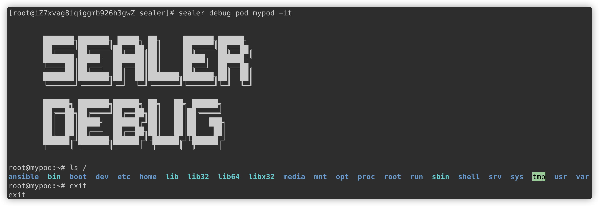
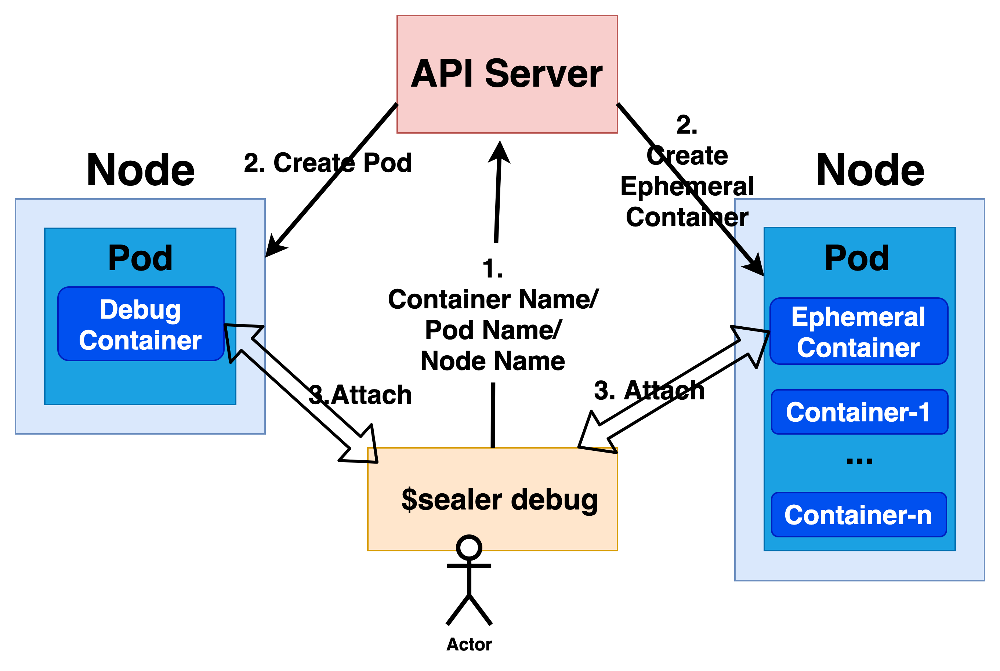

# What is sealer debug

`sealer debug` can debug nodes, pods and containers with plenty of useful tools. Based on `sealer debug` , SRE can locate the problems of nodes, pods or containers.

You can use `sealer debug pod mypod -it`  to debug the pod named `mypod`. It will create an interactive debugging session in pod `mypod` and immediately attach to it.  In this way, you can use plenty of useful tools to debug `mypod` and the first container of `mypod`.



## Use Cases

Here are some examples of using cases.

```
# Debug Node `mynode` and immediately attach to the debug pod.
$ sealer debug node mynode -it
You don't specify an image, it will use the default image: debug:ubuntu
You can use `--image` to specify an image, just like `sealer debug node NODE_NAME --image busybox`.
The debug pod or container id: sealer-pod-debugger-khwbl.mynode.default
root@mynode:~# ls
motd
root@mynode:~#

# In node `mynode`, executing commands without tty. The commands used are debug pod.
$ sealer debug node mynode ls /

# In node `mynode`, executing commands with tty. The commands used are debug pod.
$ sealer debug node mynode -it bash

# Use image `busybox` to debug node `mynode`.
$ sealer debug node mynode -it --image busybox

# It will only a debug pod in node, but will not immediately attach to the debug pod. Users can use the returned debug ID to attach to the debug pod to debug the node.
# debug ID format is `container_name.pod_name.namespace`.
$ sealer debug node mynode

# Debug node `mynode` with envionment variables.
$ sealer debug node mynode -it --env yyds=sealer,debug=sealer

# Debug node `mynode` and set some check items. After attaching to the debug pod , it will check the specified check items automatic and show the check results.
# Attention: currently, `sealer debug` can only use this with default image.
$ sealer debug node mynode -it --check-list=dns,network

# Debug node `mynode`, and we can specify the container name in debug pod.
$ sealer debug node mynode -it --name sealer-demo
```

Just like `sealer debug node`, so only list some case

```
# Debug pod `mypod` and immediately attach to the debug container.
$ sealer debug pod mypod -it

# Debug pod `mypod`and we can specify the debug container name.
$ sealer debug pod mypod -it --name sealer-demo

# Default it will debug the first container in pod `mypod`. This way, it will debug the container `mypod` in pod `mypod`.
$ sealer debug pod mypod -c podaa -it

# Debug `coredns` pod in namespace kube-system.
$ sealer debug pod coredns-b55nb -n kube-system -it
```

The `sealer debug` also provides some default images.

```
# Show the defautl images provided by sealer.
$ sealer debug show-images
There are several default images you can use：
RichToolsOnUbuntu:  debug:ubuntu
RichToolsOnAlpine:  debug:apline
```

`sealer debug node mynode/pod mypod` will generate a debug pod/container, but it will not be cleaned automatically. So we can use `sealer debug clean [DEBUG_ID]` to clean the generated debug pod or container.

```
# Clean generated debug pod/container using debug ID.
$ sealer debug clean sealer-pod-debugger-khwbl.mynode.default
```

## Implementation



When debug node, `sealer debug node` will create a debug pod on node, and it will attach to the debug pod. So it can debug the node with the tools provided by debug pod.

Just like debug node, `sealer debug pod` will create a debug container in pod, and it will attach to the debug container to debug pod/container with the tools provided by debug container.

When the debug is done, the generated debug pods or debug containers will be cleaned automatically.

Besides, `sealer debug` also provide some default images for debugging. You can use `sealer debug show-images` to look th default images provided.